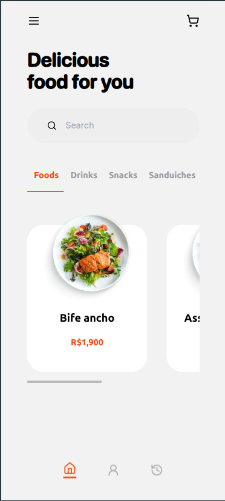
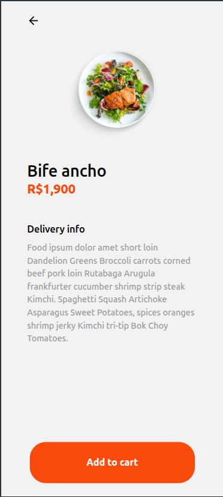

# delivery-ui
## Sobre
Interface de usuário em React, inspirada em aplicativos de cardápio. 

Algumas das funcionalidades / técnicas que usei foram:
- React e Next.JS
- Tailwind.css
- Criação de componentes (com e sem estado)
- Manipulação de estado do APP
- Roteamento
- Responsividade
- Utilização de fontes personalizadas
- Media Queries
- Deploy com CI/CD na Vercel

## Deploy na vercel
[delivery-ui](https://app-delivery-ui.vercel.app/app)